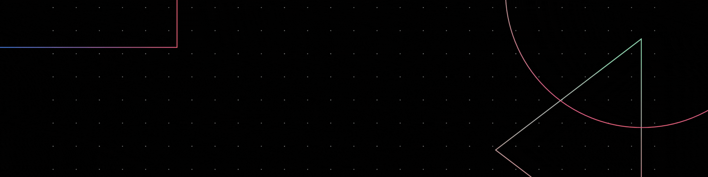

<!--Banner-->
  

  
 <i>Backend Developer and Automation Engineer</i> 

  I am a <b>Backend developer and Automation Engineer</b>r with experience in Node.js, Express, Rust, JavaScript and Python, among others, along with experience in building APIs, clean code practices, backend systems, etc.

---

<!-- Tecnologies -->
## Tecnologies

Want to learn all the languages ​​and tools I use?

[Click here!](./tecnologies.md)

  

<!-- - Student of life :)
- I’m currently learning many things, I believe that everyday is a learning opportunity.
- Lover of clean and scalable code
- Member and collaborator of the DkSoluciones organization
- Contributing to Open Source. -->

<!-- 

  <picture>
    <source media="(prefers-color-scheme: dark)" srcset="./Skills_Animation_Dark.gif">
    <source media="(prefers-color-scheme: light)" srcset="./Skills_Animation_White.gif">
    
  </picture>

