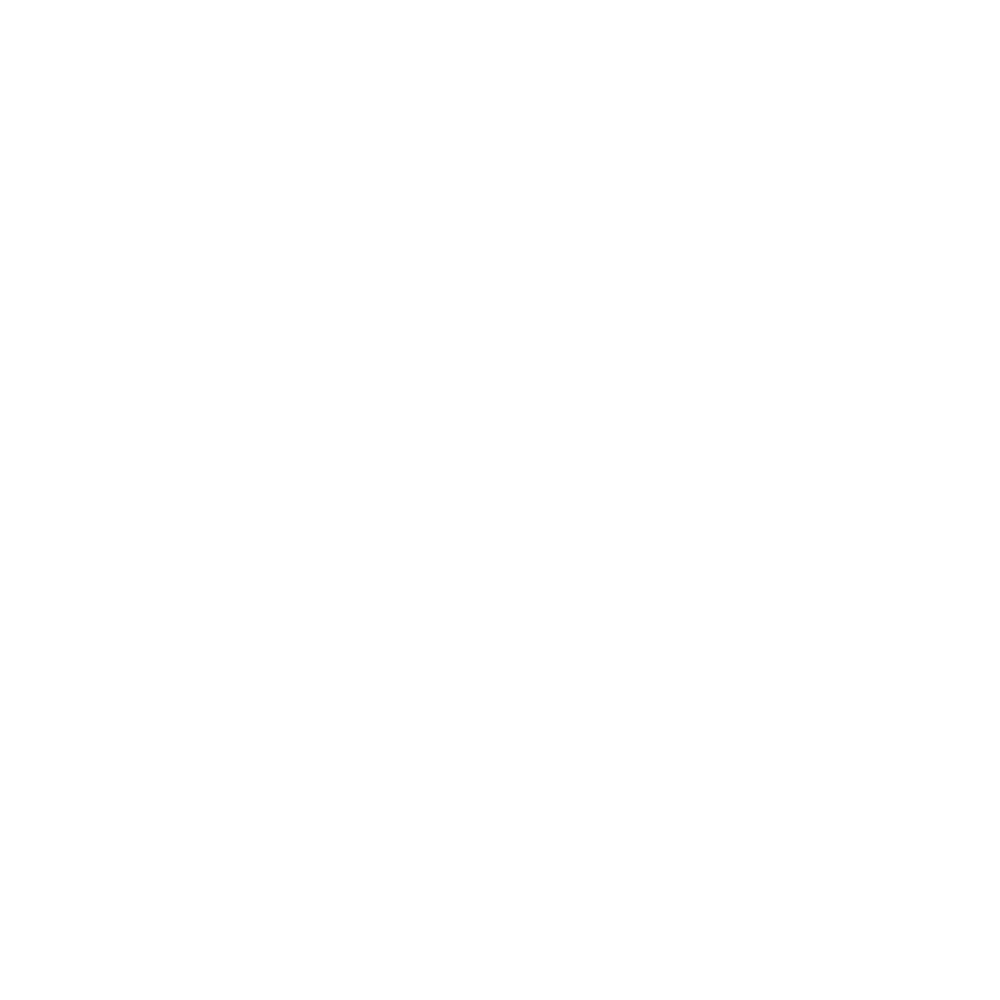

<!--Banner-->
  

  
 <i>Backend Developer and Automation Engineer</i> 

  I am a <b>Backend developer and Automation Engineer</b>r with experience in Node.js, Express, Rust, JavaScript and Python, among others, along with experience in building APIs, clean code practices, backend systems, etc.

---

<!-- Tecnologies -->

  <h2>Technologies</h2>

 <!-- JavaScript -->
 <!-- Python -->
 <!-- Rust -->
 <!-- PostgreSQL -->
 <!-- SQLite -->
 <!-- MongoDB -->
 <!-- Node.Js -->
 <!-- Express.Js -->
 <!-- FastApi -->
 <!-- Pandas -->
 <!-- Prisma -->
 <!-- Api -->
 <!-- VsCode  -->
 <!-- Postman -->
 <!-- Bash -->
 <!-- Git -->
 <!-- GitHub -->
 <!-- Swagger -->
 <!-- Vercel -->
 <!-- Railway -->
 <!-- Docker -->

###### Icons by [icons8](https://iconos8.es/)

  

<!--  -->

<!-- - Student of life :)
- I’m currently learning many things, I believe that everyday is a learning opportunity.
- Lover of clean and scalable code
- Member and collaborator of the DkSoluciones organization
- Contributing to Open Source. -->

<!-- 

  <picture>
    <source media="(prefers-color-scheme: dark)" srcset="./Skills_Animation_Dark.gif">
    <source media="(prefers-color-scheme: light)" srcset="./Skills_Animation_White.gif">
    
  </picture>

 -->
