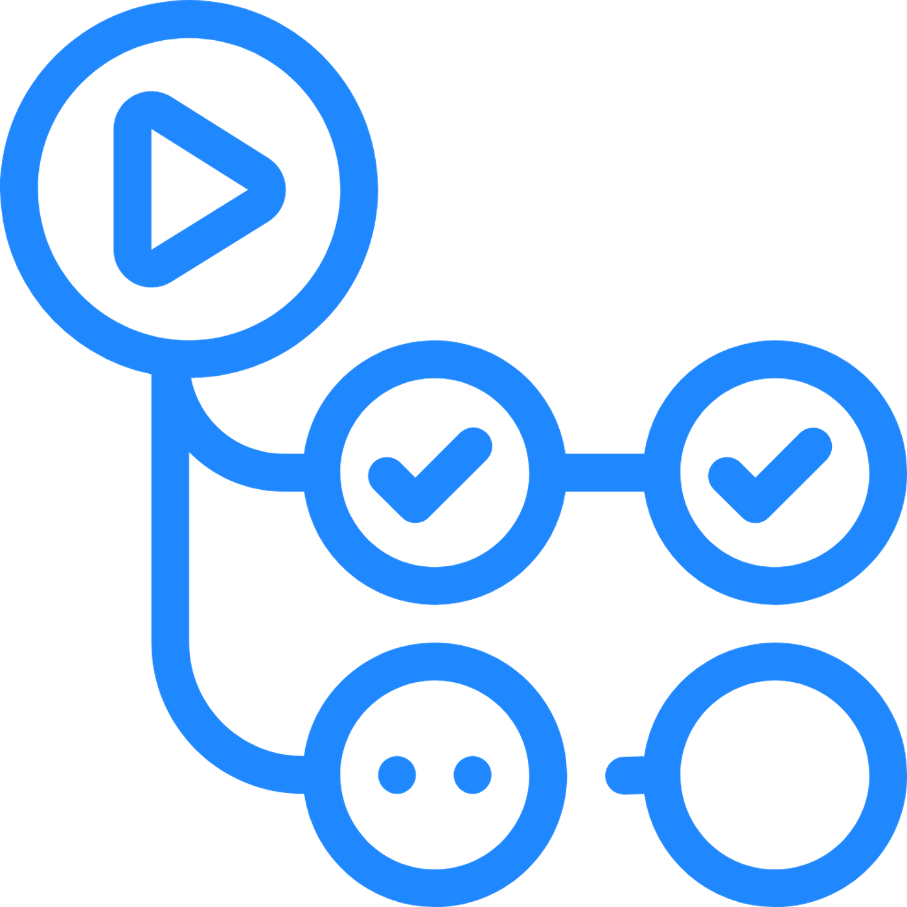

# Tecnologies

---

##  Languajes

 <!-- JavaScript -->
 <!-- Python -->
 <!--Rust -->

## Databases and ORM'S

 <!-- PostgreSQL -->
 <!-- Redis -->
 <!-- SQLite -->
 <!-- MongoDB -->
 <!-- Prisma -->

# Frameworks

 <!-- Node.Js -->
 <!-- Express.Js -->
 <!-- FastApi -->
 <!-- Flask -->

## Libs

 <!-- Pandas -->
 <!-- Swagger -->
 <!-- Api -->

## Tools

 <!-- VsCode  -->
 <!-- Postman -->
 <!-- Bash -->
 <!-- Git -->
 <!-- GitHub -->
 <!-- GitHub Actions-->
 <!-- Vercel -->
 <!-- Railway -->
 <!-- Docker -->

---

###### Resources By [icons8](https://iconos8.es/)

